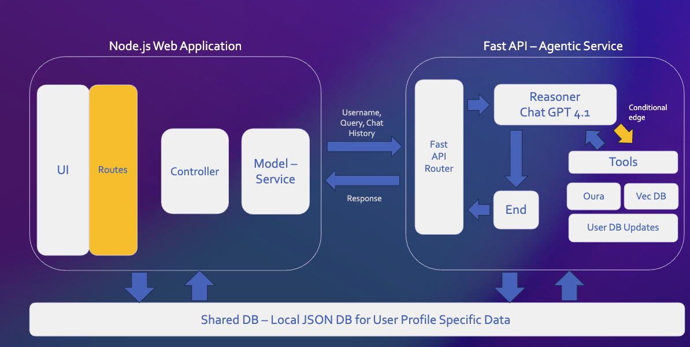

# Pulsy - Your AI Advisor for your Wearable Devices 🧠⌚️

**Transform your health data into actionable insights with Pulsy - an AI advisor that utilizes context from your Oura Ring data and documents from health experts (Andrew Huberman Labs) to provide you with ways to optimize your day**

---

## Overview 🌟
Pulsy combines a web interface with and Agentic RAG framework to help users gain insights from their health and wellness data. Key features include:
- **Pulsy - your Agent**: can retrieve relevant wearable data based on the question you ask it - this approach provides a generalizable process for your needs/questions

- **Goal-Based Workflow**: agentic capability to document, update and summarize your progress towards reaching your goals

- **Vector-Based Knowledge Retrieval**: RAG implementation using state-of-the-art embedding models to extract semantically relevant insights from documents

## System Architecture ⚙️

## Tech Stack 🛠

## Demo Video 🎥
<video width="100%" controls>
  <source src="readme_assets/Pulsy_Demo.mp4" type="video/mp4">
  Your browser does not support the video tag.
</video>

---
## Getting Started 🚀

---
### ToDo's For The Repo
**AI Backend**

☐ Add proper 400 - 500 error code handling and raising for API interfaces

☐ Error handling - for FileNotFound type errors when accessing shared user_state.json and config.yaml

☐ Look into Pydantic methods to parse the response of the Oura Ring related tools - https://python.langchain.com/api_reference/core/output_parsers/langchain_core.output_parsers.openai_tools.PydanticToolsParser.html

**Web App**

☐ Refresh Chat page after Goal Creation to show the new goal element for user reference

**Overall**

☐ Host this application on the web
☐ Integrate GPT-OSS