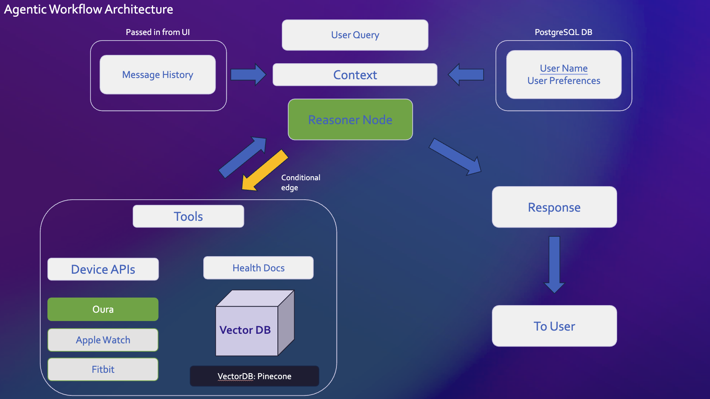

# Pulsy — Agentic RAG for Wearable Health Intelligence

Pulsy is an agentic retrieval-augmented generation (RAG) system that transforms Oura Ring data into personalized, evidence-grounded health guidance.

## What Problem Does Pulsy Solve?

Raw wearable metrics (sleep score, HRV, stress) lack context.
Pulsy bridges biometric trends with curated scientific micro-insights through structured retrieval and agentic reasoning loops.

## 📊 System Performance Overview

> Metrics evaluated on the same benchmark dataset.

<table align="center" style="width:100%;">
  <tr>
    <th>
Metric
</th>
    <th>
Baseline (v0)
</th>
    <th>
Optimized (v1)
</th>
    <th>
Δ Improvement
</th>
    <th width="45%">
Notes
</th>
  </tr>

  <tr>
    <td align="center">Tool Call Accuracy</td>
    <td align="center"><b>0.90</b></td>
    <td align="center"><b>0.90</b></td>
    <td align="center">—</td>
    <td align="center">No change</td>
  </tr>

  <tr>
    <td align="center">Precision@3</td>
    <td align="center"><b>0.36</b></td>
    <td align="center"><b>0.68</b></td>
    <td align="center"><b>+90%</b></td>
    <td align="center">Embedding → <code>llama-text-embed-v2</code> · Chunking → <code>cs500/co100</code></td>
  </tr>

  <tr>
    <td align="center">Hits@3</td>
    <td align="center"><b>0.60</b></td>
    <td align="center"><b>0.91</b></td>
    <td align="center"><b>+51%</b></td>
    <td align="center">Embedding → <code>llama-text-embed-v2</code> · Chunking → <code>cs500/co100</code></td>
  </tr>

  <tr>
    <td align="center">MRR@3</td>
    <td align="center"><b>0.48</b></td>
    <td align="center"><b>0.76</b></td>
    <td align="center"><b>+61%</b></td>
    <td align="center">Embedding → <code>llama-text-embed-v2</code> · Chunking → <code>cs500/co100</code></td>
  </tr>

  <tr>
    <td align="center">p50 Latency (E2E)</td>
    <td align="center"><b>6.26s</b></td>
    <td align="center"><b>6.26s</b></td>
    <td align="center">—</td>
    <td align="center">No change</td>
  </tr>

  <tr>
    <td align="center">p95 Latency (E2E)</td>
    <td align="center"><b>27.05s</b></td>
    <td align="center"><b>27.05s</b></td>
    <td align="center">—</td>
    <td align="center">Tail latency debugging in progress</td>
  </tr>
</table>

## 🛠 Tech Stack

  
  
  
  
  
  
  
  
  

---

## 🧩 System Architecture (High-Level)

**Pulsy** is built as a modular AI pipeline composed of:

1. **Frontend (Node.js/EJS)** – session management, UI, routing  
2. **Backend API (FastAPI)** – wearable ingestion, RAG retrieval, stateless inference 
3. **Agent Layer (LangGraph)** – orchestrates tool calls, retrieval, and reasoning  
4. **Vector Store (Pinecone)** – semantic search over curated health corpus  
5. **PostgreSQL** – users, device bindings, logs, and session insights  

### Agentic Architecture Diagram

---

## 🗺 Roadmap / TODO

### 🟩 Core Improvements
- [ ] Optimize Retrieval via evaluating different Chunking/Overlap   
- [ ] Expand health corpus to training load, circadian, recovery, metabolic health
- [ ] Create comprehensive Evaluation Framework to quantify performance of Agent

### 🧪 AI / Modeling
- [ ] Transition from OpenAI API to local LLM via Ollama
- [ ] SFT on application specific dataset 

### 📱 Future Integrations
- [ ] Apple HealthKit  
- [ ] WHOOP

---

## 🤝 Contributing

If you have ideas, suggestions, or improvements, **I would love to learn from you**.  
Feel free to open an issue or **submit a PR** — especially if you’d like to collaborate on:

- agentic workflows  
- health-focused RAG systems  
- app design and usability  
